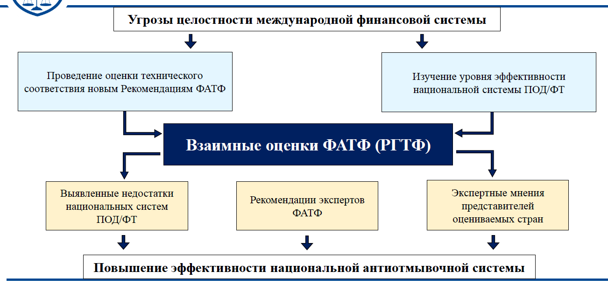
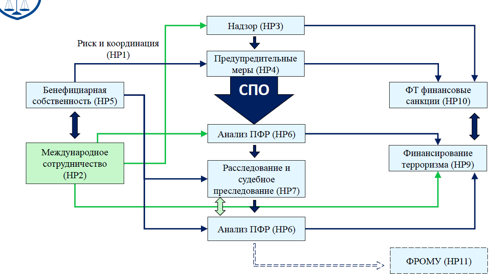

## Лекция 3. Международные стандарты ПОД/ФТ/ФРОМУ

### Международные стандарты ПОД/ФТ/ФРОМУ

Рекомендации ФАТФ устанавливают комплексную и последовательную **структуру мер** которые странам следует применять для ПОД/ФТ/ФРОМУ

1. определять риски и разрабатывать политику и координацию внутри страны
2. преследовать отмывание денег, финансирование терроризма и финансирование распространения оружия массового уничтожения
3. применять превентивные меры для финансового сектора и определенных иных секторов
4. устанавливать полномочия и ответственность компетентных органов (следственных, правоохранительных и надзорных органов) и иные институциональные меры
5. укреплять прозрачность и доступность информации о бенефициарной собственности юридических лиц и образований
6. обеспечивать международное сотрудничество

Khuyến nghị của FATF thiết lập một **cấu trúc các biện pháp** toàn diện và nhất quán mà các quốc gia nên áp dụng cho AML/CFT/PWF

1. xác định rủi ro và xây dựng chính sách cũng như sự phối hợp trong nước
2. Truy tố tội rửa tiền, tài trợ khủng bố và tài trợ phổ biến vũ khí hạt nhân
3. áp dụng các biện pháp phòng ngừa đối với lĩnh vực tài chính và một số lĩnh vực khác
4. thiết lập quyền hạn và trách nhiệm của các cơ quan có thẩm quyền (cơ quan điều tra, thực thi pháp luật và giám sát) và các biện pháp thể chế khác
5. tăng cường tính minh bạch và sẵn có của thông tin về quyền sở hữu hưởng lợi của các pháp nhân và thỏa thuận
6. đảm bảo hợp tác quốc tế

### Стандарты ФАТФ

В Рекомендациях ФАТФ установлены **минимальные требования** касающиеся мер, которые должны быть реализованы странами для борьбы с ОД и ФТ

Khuyến nghị của FATF thiết lập **các yêu cầu tối thiểu** liên quan đến các biện pháp mà các quốc gia phải thực hiện để chống ML và TF

---

Эффективное выполнение Рекомендаций ФАТФ обеспечивает **эффективную базу** для противодействия ОД и ФТ

Việc thực hiện hiệu quả các Khuyến nghị của FATF cung cấp **cơ sở hiệu quả** để chống lại ML và TF

---

Поскольку террористы и другие преступники всегда будут использовать самое слабое звено, необходимо **последовательное выполнение** Рекомендаций **всеми странами**

Vì những kẻ khủng bố và tội phạm khác sẽ luôn khai thác mắt xích yếu nhất nên **việc triển khai nhất quán** Khuyến nghị của **tất cả các quốc gia** là cần thiết

---

Страны лучше всех могут судить об угрожающих им рисках ОД и ФТ и должны обеспечить, чтобы реализуемые ими меры ПОД/ФТ были направлены на надлежащее **снижение таких рисков**

Các quốc gia có vị trí tốt nhất để đánh giá các rủi ro ML và TF mà họ phải đối mặt và phải đảm bảo rằng các biện pháp AML/CFT của họ được thiết kế để **giảm thiểu những rủi ro đó** một cách thỏa đáng

### Методология оценки технического соответствия Рекомендациям ФАТФ и эффективности систем ПОД/ФТ

Для **четвёртого раунда** взаимных оценок ФАТФ приняла **взаимодополняющие подходы** к оценке технического соответствия Рекомендациям ФАТФ и оценке того, является ли система ПОД/ФТ эффективной и до какой степени

Đối với **Vòng thứ tư** của Đánh giá lẫn nhau, FATF đã thông qua **Các phương pháp tiếp cận bổ sung** để đánh giá sự tuân thủ kỹ thuật với Khuyến nghị của FATF và đánh giá liệu hệ thống AML/CFT có hiệu quả hay không và ở mức độ nào

---

Методология оценки технического соответствия Рекомендациям ФАТФ и эффективности систем ПОД/ФТ предназначена **для оказания содействия экспертам-оценщикам** при проведении оценки соблюдения страной международных стандартов ПОД/ФТ

Phương pháp đánh giá sự tuân thủ kỹ thuật với Khuyến nghị của FATF và tính hiệu quả của hệ thống AML/CFT nhằm **hỗ trợ các chuyên gia đánh giá** đánh giá sự tuân thủ của một quốc gia với các tiêu chuẩn AML/CFT quốc tế

---

Отражает требования, изложенные в Рекомендациях ФАТФ и Пояснительных записках, которые устанавливают международный стандарт противодействия отмыванию денег и финансированию терроризма и распространения ОМУ, не изменяя и **не превышая эти требования**

Phản ánh các yêu cầu được nêu trong Khuyến nghị và Ghi chú Giải thích của FATF, trong đó đặt ra tiêu chuẩn quốc tế để chống rửa tiền và chống tài trợ cho khủng bố và phổ biến vũ khí hủy diệt hàng loạt mà không thay đổi hoặc **vượt quá các yêu cầu này**

---

При подготовке Методологии использован **опыт проведения оценок соответствия более ранним версиям** Рекомендаций ФАТФ, накопленный ФАТФ, Региональными группами по типу ФАТФ (РГТФ) Международным Валютным Фондом и Всемирным Банком

Khi chuẩn bị Phương pháp luận, **kinh nghiệm thực hiện đánh giá tuân thủ các phiên bản trước** của Khuyến nghị FATF do FATF, các Nhóm khu vực loại FATF (RGTF), Quỹ Tiền tệ Quốc tế và Ngân hàng Thế giới tích lũy đã được sử dụng.

### Риск ориентированный подход и оценка рисков (Р.1)

Странам следует **определить и оценить риски** отмывания денег и финансирования терроризма и следует предпринять шаги в том числе, определив орган или механизм по координации мер по оценке рисков, а также распределить ресурсы с целью эффективного снижения этих рисков

Các quốc gia nên **xác định và đánh giá rủi ro** của hoạt động rửa tiền và tài trợ khủng bố và nên thực hiện các bước, bao gồm xác định một cơ quan hoặc cơ chế để điều phối các nỗ lực đánh giá rủi ro và phân bổ nguồn lực để giảm thiểu những rủi ro này một cách hiệu quả

---

На основе этой оценки странам следует **применять риск ориентированный подход (РОП)** для того, чтобы меры по предупреждению отмывания денег и финансирования терроризма соответствовали выявленным рискам Этот подход должен стать основой для эффективного распределения ресурсов в рамках национального режима ПОД/ФТ и применения риск ориентированных мер в соответствии с Рекомендациями ФАТФ Там, где страны выявили более высокие риски, им следует обеспечить, чтобы их режим ПОД/ФТ адекватно реагировал на них

Dựa trên đánh giá này, các quốc gia nên **áp dụng cách tiếp cận dựa trên rủi ro (RBA)** để đảm bảo rằng các biện pháp chống rửa tiền và tài trợ khủng bố phù hợp với những rủi ro đã được xác định. Cách tiếp cận này sẽ tạo cơ sở cho việc phân bổ nguồn lực hiệu quả. trong chế độ AML/CFT quốc gia và thực thi các biện pháp định hướng rủi ro theo Khuyến nghị của FATF. Khi các quốc gia đã xác định được rủi ro cao hơn, họ phải đảm bảo rằng chế độ AML/CFT của mình giải quyết chúng một cách thỏa đáng

---

Там, где страны выявили более низкие риски, они могут решить применять **упрощённые меры** для некоторых из Рекомендаций ФАТФ при определённых условиях

Khi các quốc gia xác định được rủi ro thấp hơn, họ có thể quyết định áp dụng **các biện pháp đơn giản hóa** đối với một số Khuyến nghị của FATF trong một số điều kiện nhất định

---

**Страны должны требовать**, чтобы финансовые учреждения и установленные нефинансовые предприятия и профессии (УНФПП) определяли, оценивали и принимали меры по снижению собственных рисков отмывания денег и финансирования терроризма

**Các quốc gia nên yêu cầu** các tổ chức tài chính cũng như các doanh nghiệp và ngành nghề phi tài chính được chỉ định (DNFBP) xác định, đánh giá và thực hiện các biện pháp nhằm giảm rủi ro rửa tiền và tài trợ khủng bố của chính họ

### Новое понимание риск-ориентированного подхода

1. Р.1 - новая Рекомендация по РОП, которая устанавливает принципы и требования к её
применению 
2. РОП применяется ко всем Рекомендациям ФАТФ
3. Ряд аспектов РОП прямо прописаны в Рекомендациях (например, Р.10 (НПК))
4. Устанавливает требования для стран, финансовых учреждений и УНФПП

---

1. R.1 - Khuyến nghị mới về EPR, trong đó thiết lập các nguyên tắc và yêu cầu đối với
ứng dụng
2. RBA áp dụng cho tất cả Khuyến nghị của FATF
3. Một số khía cạnh của RBA được nêu rõ trong Khuyến nghị (ví dụ: R.10 (NPC))
4. Thiết lập các yêu cầu đối với các quốc gia, tổ chức tài chính và DNFBP

### Оценка рисков

1. Страны должны выявлять, оценивать и понимать риски ОД/ФТ
2. Финансовые учреждения и УНФПП должны выявлять, оценивать, понимать риски ОД/ФТ и разрабатывать программы по их снижению и управлению
3. Оценка рисков основа для любого режима ПОД/ФТ (для управления рисками, их снижения, применения дополнительных мер при высоко рисковых сценариях эффективного распределения ресурсов)
4. ФАТФ разработано Руководство по национальной оценке рисков как глобальное, так и секторальное

---

1. Các quốc gia phải xác định, đánh giá và hiểu rõ rủi ro ML/TF
2. Các tổ chức tài chính và DNFBP phải xác định, đánh giá, hiểu rủi ro ML/TF và phát triển các chương trình để giảm thiểu và quản lý chúng
3. Đánh giá rủi ro là cơ sở cho mọi cơ chế AML/CFT (để quản lý rủi ro, giảm thiểu rủi ro, áp dụng các biện pháp bổ sung trong các tình huống rủi ro cao nhằm phân bổ nguồn lực hiệu quả)
4. FATF đã xây dựng Hướng dẫn đánh giá rủi ro quốc gia, cả ở cấp độ toàn cầu và cấp ngành.

### Риск-ориентированный подход

**Основные принципы**

1. Высокий риск $\rightarrow$ требуются усиленные меры
2. Низкий риск $\rightarrow$ возможны упрощённые меры

**Nguyên tắc cơ bản**

1. Rủi ro cao $\rightarrow$ yêu cầu các biện pháp tăng cường
2. Có thể áp dụng các biện pháp đơn giản hóa $\rightarrow$ rủi ro thấp

---

**Задачи**

1. Фокус на более высоких рисках для более эффективной реализации Рекомендаций
2. Более эффективное распределение и использование ресурсов

**Nhiệm vụ**

1. Tập trung vào những rủi ro cao hơn để thực hiện Khuyến nghị hiệu quả hơn
2. Phân bổ và sử dụng nguồn lực hiệu quả hơn

### Отмывание денег и конфискация (Р.3 и Р.4)

**Основные последствия**

- определение компетентных органов, отвечающих за расследование ОД и предикатных преступлений, включены налоговые органы
- международное сотрудничество
- направление сообщений о подозрительных операциях

**Hậu quả chính**

- Quyết định của cơ quan có thẩm quyền chịu trách nhiệm điều tra tội rửa tiền và tội phạm nguồn, trong đó có cơ quan thuế
- Hợp tác quốc tế
- gửi báo cáo về các giao dịch đáng ngờ

---

**Расширен список предикатных преступлений** для отмывания денег, в который теперь входят серьёзные (тяжкие) налоговые преступления

**Danh sách các tội phạm nguồn** về rửa tiền đã được mở rộng để bao gồm các tội phạm nghiêm trọng về thuế

---

**Дополнительная установленная категория преступлений**: налоговые преступления (связанные с прямыми и косвенными налогами)

**Loại tội phạm được xác định bổ sung**: tội phạm về thuế (liên quan đến thuế trực tiếp và gián tiếp)

---

**Уточнено - контрабанда** (в отношении таможенных и акцизных налогов и сборов)

**Đã làm rõ - buôn lậu** (liên quan đến hải quan và thuế tiêu thụ đặc biệt)

---

Введение **конфискации** без осуждения

Giới thiệu việc **tịch thu** mà không bị kết án

---

**Определение серьёзных (тяжких) налоговых преступлений** оставлено на усмотрение каждой страны, но оно оставлено

**Định nghĩa về tội phạm nghiêm trọng về thuế** được tùy theo quyết định của mỗi quốc gia, nhưng nó được để lại

### Целевые финансовые санкции, относящиеся к ОМУ (Р.7)

Страны должны применять **адресные финансовые санкции** (замораживание (незамедлительно) + запрет), предусмотренные соответствующими Резолюциями СБ ООН, касающимися распространения ОМУ аналогично требованиям, касающимся терроризма и финансирования терроризма физические и юридические лица могут включаться в списки Советом Безопасности ООН в соответствии с

- Резолюцией СБ ООН 1718 и принятыми в её развитие Резолюциями (КНДР)
- Резолюцией СБ ООН 1737 и принятыми в её развитие Резолюциями (Иран)

Các quốc gia phải áp dụng **các biện pháp trừng phạt tài chính có mục tiêu** (đóng băng (ngay lập tức) + lệnh cấm) được quy định trong các Nghị quyết liên quan của Hội đồng Bảo an Liên Hợp Quốc liên quan đến phổ biến WMD, tương tự như các yêu cầu liên quan đến khủng bố và tài trợ khủng bố, các cá nhân và pháp nhân có thể được đưa vào danh sách của Hội đồng Bảo an Liên Hợp Quốc theo quy định của

- Nghị quyết 1718 của Hội đồng Bảo an Liên hợp quốc và các Nghị quyết được thông qua trong quá trình phát triển (CHDCND Triều Tiên)
- Nghị quyết 1737 của Hội đồng Bảo an Liên hợp quốc và các Nghị quyết được thông qua trong quá trình phát triển (Iran)

---

Сотрудничество и взаимодействие на национальном уровне.

Hợp tác và tương tác ở cấp quốc gia.

---

Требуется участие органов, отвечающих за противодействие финансированию распространения ОМУ.

Cần có sự tham gia của các cơ quan có trách nhiệm chống lại việc tài trợ cho việc phổ biến vũ khí hủy diệt hàng loạt.

### Публичные должностные лица (Р.12)

- Существующие меры для иностранных публичных должностных лиц остались неизменными (применяются усиленные меры по НПК)
- Положения Рекомендации охватывают теперь и национальных публичных должностных лиц и из международных организаций
- Меры для национальных публичных должностных лиц и из международных организаций применяются на основании РОП ТОЛЬКО в высоко рисковых ситуациях Если публичное должностное лицо признается высоко рисковым, то применяются усиленные меры по НПК

---

- Các biện pháp hiện hành đối với công chức nước ngoài không thay đổi (áp dụng các biện pháp CDD nâng cao)
- Các quy định của Khuyến nghị hiện nay áp dụng cho cả công chức quốc gia và các tổ chức quốc tế
- Các biện pháp dành cho quan chức quốc gia và từ các tổ chức quốc tế CHỈ được áp dụng trên cơ sở RBA trong các tình huống có rủi ro cao. Nếu một quan chức nhà nước được coi là có nguy cơ cao thì các biện pháp CDD tăng cường sẽ được áp dụng.

### Бенефициарные владельцы: требования ФАТФ

**Требования ФАТФ** в отношении бенефициарных владельцев были **пересмотрены**

**FATF** Yêu cầu về quyền sở hữu hưởng lợi đã được **Sửa đổi**

---

**Третий раунд взаимных оценок** показал низкий уровень соответствия требования по идентификации и верификации БВ и хранению информации о них

**Vòng đánh giá chung thứ ba** cho thấy mức độ tuân thủ thấp với các yêu cầu về nhận dạng, xác minh BV cũng như lưu trữ thông tin về họ

---

Однако **основной принцип остался неизменным**: компетентные органы должны иметь своевременный доступ к точной информации о бенефициарных владельцах

Tuy nhiên, **nguyên tắc cốt lõi vẫn giữ nguyên**: cơ quan có thẩm quyền phải tiếp cận kịp thời thông tin chính xác về chủ sở hữu hưởng lợi

---

Обеспечить своевременный доступ к достаточной, точной и актуальной информации о бенефициарной собственности и контроле компаний и других юридических лиц (информация о бенефициарном владении), созданных в стране

Đảm bảo truy cập kịp thời vào thông tin đầy đủ, chính xác và cập nhật về quyền sở hữu và kiểm soát người hưởng lợi của các công ty và pháp nhân khác (thông tin về quyền sở hữu người hưởng lợi) được thành lập ở trong nước

### Процедуры взаимной оценки национальных антиотмывочных систем

### Эффективность - 11 «Непосредственных результатов»

Методологии оценки технического соответствия Рекомендациям ФАТФ и эффективности систем ПОД/ФТ определяют эффективность

- применения 40 Рекомендаций ФАТФ
- работы системы ПОД/ФТ

Các phương pháp đánh giá sự tuân thủ kỹ thuật với Khuyến nghị của FATF và tính hiệu quả của hệ thống AML/CFT quyết định tính hiệu quả

- áp dụng 40 Khuyến nghị của FATF
- vận hành hệ thống AML/CFT

### Непосредственный результат 1 - Риск и координация

Риски ОД и ФТ понимаются и, при необходимости, координируются внутри страны для борьбы с ОД, ФТ и ФРОМУ

- Насколько хорошо страна понимает свои риски?
- Насколько хорошо устраняются риски?
- Есть ли прочная основа для изъятий, упрощённых мер и усиленных мер?
- Насколько хорошо власти сотрудничают и координируются?
- Насколько осведомлены о рисках финансовые учреждения и УНФПП?

Rủi ro ML và TF được hiểu rõ và phối hợp trong nước khi cần thiết để chống lại ML, TF và PFUR

- Đất nước hiểu rõ những rủi ro của mình đến mức nào?
- Rủi ro được giải quyết tốt như thế nào?
- Có cơ sở vững chắc cho việc miễn trừ, biện pháp đơn giản, biện pháp tăng cường hay không?
- Các cơ quan chức năng phối hợp, phối hợp tốt như thế nào?
- Các tổ chức tài chính và DNFBP nhận thức được rủi ro như thế nào?

### Непосредственный результат 2 - Международное сотрудничество

В рамках международного сотрудничества предоставляется соответствующая информация, данные финансовой разведки и доказательства, а также облегчается принятие мер против преступников и их активов

- Насколько эффективно страна оказывает взаимную юридическую помощь (ВЮП)?
- Насколько эффективно страна запрашивает ВЮП?
- Насколько эффективно страна запрашивает другие виды помощи?
- Насколько эффективно страна оказывает другие виды помощи?
- Насколько эффективно страна предоставляла информацию о бенефициарной собственности?

Hợp tác quốc tế cung cấp thông tin liên quan, thông tin tình báo và bằng chứng tài chính, đồng thời tạo điều kiện thuận lợi cho hành động chống lại tội phạm và tài sản của chúng

- Nước này thực hiện tương trợ pháp lý (MLA) hiệu quả như thế nào?
- Hiệu quả của quốc gia trong việc yêu cầu VLE như thế nào?
- Hiệu quả của quốc gia trong việc yêu cầu các hình thức hỗ trợ khác như thế nào?
- Hiệu quả của quốc gia trong việc cung cấp các hình thức hỗ trợ khác như thế nào?
- Quốc gia đó đã cung cấp thông tin về quyền sở hữu có hiệu quả như thế nào?

### Непосредственный результат 3 - Надзор

Надзорные органы надлежащим образом проводят мониторинг, контролируют и регулируют финансовые учреждения и УНФПП на предмет соблюдения требований ПОД/ФТ, соразмерных их рискам

- Насколько эффективно страна не допускает владение ФИ и УНФПП преступниками и их сообщниками?
- Насколько хорошо надзорные органы понимают риски?
- Насколько эффективно надзорные органы следят за соблюдением финансовыми учреждениями и УНФПП требований ПОД/ФТ?
- В какой степени применяются меры и/или санкции?
- Могут ли надзорные органы продемонстрировать степень влияния на эффективность соответствия?
- Способствуют ли надзорные органы пониманию финансовыми институтами и УНФПП рисков?

Cơ quan giám sát giám sát, giám sát và quản lý các tổ chức tài chính và DNFBP một cách thích hợp trong việc tuân thủ các yêu cầu AML/CFT tương xứng với rủi ro của họ

- Quốc gia ngăn chặn tội phạm và đồng bọn của chúng sở hữu FI và DNFBP hiệu quả như thế nào?
- Người giám sát hiểu rõ rủi ro đến mức nào?
- Cơ quan giám sát giám sát việc tuân thủ các yêu cầu AML/CFT của các tổ chức tài chính và DNFBP một cách hiệu quả như thế nào?
- Các biện pháp và/hoặc chế tài được áp dụng ở mức độ nào?
- Người giám sát có thể chứng minh mức độ tác động đến hiệu quả tuân thủ không?
- Cơ quan giám sát có khuyến khích các tổ chức tài chính và DNFBP hiểu rõ rủi ro không?

### Непосредственный результат 4 - Предупредительные меры

Финансовые учреждения и УНФПП адекватно применяют превентивные меры в области ПОД/ФТ, соразмерные их рискам, и сообщают о подозрительных операциях

- Насколько хорошо ФИ и УНФПП понимают свои риски и обязанности?
- Насколько эффективно они применяют меры по снижению рисков?
- Насколько эффективно они применяют меры НПК и хранят данные? Отказывают бизнесу?
- Насколько эффективно применяются специальные меры? (например, по ПДЛ, корреспондентскому банкингу, правилам электронных переводов, финансовым санкциям)
- Насколько хорошо они выполняют свои обязательства по предоставлению отчётности?
- Насколько хорошо они применяют внутренний контроль?

Các tổ chức tài chính và DNFBP thực hiện đầy đủ các biện pháp phòng ngừa AML/CFT tương xứng với rủi ro của mình và báo cáo các giao dịch đáng ngờ

- FI và DNFBP hiểu rõ rủi ro và trách nhiệm của mình đến mức nào?
- Họ thực hiện các biện pháp giảm thiểu rủi ro hiệu quả như thế nào?
- Họ áp dụng các biện pháp CDD và lưu trữ dữ liệu hiệu quả như thế nào? Doanh nghiệp bị từ chối?
- Hiệu quả của các biện pháp đặc biệt được áp dụng như thế nào? (ví dụ: trên PDL, ngân hàng đại lý, quy tắc chuyển tiền điện tử, trừng phạt tài chính)
- Họ thực hiện nghĩa vụ báo cáo của mình tốt đến mức nào?
- Họ áp dụng kiểm soát nội bộ tốt đến mức nào?

### Непосредственный результат 5 - Бенефициарная собственность

Не допускается неправомерное использование юридических лиц и образований в целях ОД или ФТ, и компетентные органы могут беспрепятственно получать информацию об их бенефициарной собственности

- Доступна ли информация о видах юридических лиц и образований?
- Насколько хорошо власти понимают потенциальное злоупотребление юридическими лицами?
- Насколько эффективно страна предотвращает злоупотребления?
- Могут ли органы власти получить информацию о юридических лицах?
- Могут ли власти получить информацию о юридических образованиях?
- Насколько эффективно применяются санкции за несоблюдение норм?

Các pháp nhân và thỏa thuận không được phép lạm dụng cho các mục đích ML hoặc TF và các cơ quan có thẩm quyền có thể tự do lấy thông tin về quyền sở hữu hưởng lợi của họ

- Có sẵn thông tin về các loại pháp nhân và các thỏa thuận không?
- Cơ quan chức năng hiểu rõ đến mức nào về nguy cơ lạm dụng của pháp nhân?
- Nước này ngăn ngừa lạm dụng hiệu quả như thế nào?
- Cơ quan chức năng có thể lấy được thông tin về pháp nhân không?
- Cơ quan chức năng có thể thu thập được thông tin về pháp nhân không?
- Các biện pháp trừng phạt được áp dụng hiệu quả như thế nào đối với việc không tuân thủ?

### Непосредственный результат 6 - Финансовая разведка

Данные финансовой разведки и вся другая соответствующая информация надлежащим образом используются властями для проведения расследований ОД и ФТ

- В какой степени данные финансовой разведки используются в расследованиях?
- Насколько полезны отчёты для правоохранительных органов?
- В какой степени анализ ПФР поддерживает оперативные потребности?
- В какой степени ПФР и другие компетентные органы сотрудничают?

Thông tin tài chính và tất cả các thông tin liên quan khác được cơ quan chức năng sử dụng một cách thích hợp để thực hiện các cuộc điều tra ML và TF

- Dữ liệu tình báo tài chính được sử dụng trong điều tra ở mức độ nào?
- Các báo cáo có ích như thế nào đối với các cơ quan thực thi pháp luật?
- Phân tích FIU hỗ trợ nhu cầu hoạt động ở mức độ nào?
- FIU và các cơ quan có thẩm quyền khác hợp tác ở mức độ nào?

### Непосредственный результат 7 - Расследование и судебное преследование ОД

Преступления и деятельность ОД расследуются, а правонарушители подвергаются судебному преследованию и эффективным, соразмерным и сдерживающим санкциям

- Насколько хорошо выявляются и расследуются потенциальные случаи ОД?
- Согласуются ли виды расследуемой деятельности с профилем рисков страны?
- В какой степени преследуются различные виды ОД и осуждаются правонарушители?
- Применяются ли эффективные, соразмерные и сдерживающие санкции?
- Применяют ли страны другие меры уголовного правосудия в тех случаях, когда невозможно добиться обвинительного приговора по ОД?

Các tội phạm và hoạt động ML được điều tra và những kẻ phạm tội bị truy tố và đưa ra các biện pháp trừng phạt hiệu quả, tương xứng và mang tính răn đe

- Các trường hợp tiềm ẩn của ML được xác định và điều tra tốt đến mức nào?
- Các hoạt động đang được điều tra có phù hợp với hồ sơ rủi ro của quốc gia không?
- Các loại tội rửa tiền bị truy tố và người phạm tội bị kết án ở mức độ nào?
- Các biện pháp xử phạt có được áp dụng hiệu quả, tương xứng và có tính răn đe không?
- Các nước có sử dụng các biện pháp tư pháp hình sự khác trong trường hợp không thể kết án tội rửa tiền không?

### Непосредственный результат 8 - Конфискация

Доходы и средства совершения преступлений конфискуются

- Преследуется ли конфискация доходов от преступной деятельности в качестве политической цели?
- Насколько хорошо компетентные органы конфискуют доходы от преступлений (включая внутренние и внешние преступления и доходы, которые были перемещены в другие страны)?
- В какой степени конфискация применяется в отношении ложных заявлений?
- Насколько хорошо результаты отражают риски ОД/ФТ?

Tài sản, phương tiện phạm tội bị tịch thu

- Việc tịch thu tài sản phạm tội có được theo đuổi như một mục tiêu chính trị không?
- Cơ quan có thẩm quyền tịch thu tài sản do phạm tội mà có (kể cả tài sản phạm tội trong nước, tài sản nước ngoài và tài sản đã được chuyển ra nước ngoài) hiệu quả như thế nào?
- Việc tịch thu được áp dụng ở mức độ nào đối với những lời khai sai sự thật?
- Kết quả phản ánh rủi ro ML/TF tốt đến mức nào?

### Непосредственный результат 9 - Расследование и судебное преследование ФТ

Преступления и деятельность, связанные с финансированием терроризма, расследуются, а лица, финансирующие терроризм, подвергаются судебному преследованию и эффективным, соразмерным и сдерживающим санкциям

- В какой степени преследуются различные виды деятельности ФТ? Соответствует ли это профилю риска ФТ страны?
- Насколько эффективно выявлены и расследованы случаи ФТ?
- Расследование ФТ интегрировано в национальные стратегии по борьбе с терроризмом и расследования?
- Применяются ли эффективные, соразмерные и сдерживающие санкции?
- В тех случаях, когда невозможно добиться осуждения по ФТ, используются ли другие меры для пресечения деятельности ФТ?

Các tội phạm và hoạt động liên quan đến tài trợ cho khủng bố đều bị điều tra và những kẻ tài trợ cho khủng bố bị truy tố và phải chịu các biện pháp trừng phạt hiệu quả, tương xứng và có tính răn đe.

- Các loại hoạt động TF bị truy tố ở mức độ nào? Điều này có phù hợp với hồ sơ rủi ro TF của quốc gia không?
- Các trường hợp TF được xác định và điều tra hiệu quả như thế nào?
- Cuộc điều tra của TF có được tích hợp vào các chiến lược và cuộc điều tra chống khủng bố quốc gia không?
- Các biện pháp xử phạt có được áp dụng hiệu quả, tương xứng và có tính răn đe không?
- Trong trường hợp không thể kết án TF thì có áp dụng biện pháp nào khác để trấn áp hoạt động TF không?

### Непосредственный результат 10 - Предупредительные меры ФТ

Террористы, террористические организации и спонсоры террористов не могут собирать, перемещать и использовать средства, а также неправомерно использовать НКО

- Насколько эффективно страна применяет целенаправленные финансовые санкции?
- Насколько эффективно страна действует в отношении НКО, подверженных риску неправомерного использования в целях ФТ?
- В какой степени террористы, террористические организации и спонсоры террористов лишены активов?
- Соответствует ли это общему профилю риска ФТ?

Những kẻ khủng bố, tổ chức khủng bố và tài trợ khủng bố không được thu thập, di chuyển hoặc sử dụng tiền hoặc lạm dụng NPO

- Nước này áp dụng các biện pháp trừng phạt tài chính có mục tiêu một cách hiệu quả như thế nào?
- Quốc gia hành động hiệu quả như thế nào đối với các NPO có nguy cơ bị lạm dụng vì mục đích TF?
- Bọn khủng bố, tổ chức khủng bố, tài trợ khủng bố bị tước đoạt tài sản ở mức độ nào?
- Điều này có phù hợp với hồ sơ rủi ro TF tổng thể không?

### Непосредственный результат 11 - Финансирование распространения оружия массового уничтожения (ФРОМУ)

Лицам и организациям, участвующим в распространении ОМУ, запрещается собирать, перемещать и использовать средства согласно соответствующим Резолюциям СБ ООН

- Насколько эффективно страна применяет целенаправленные финансовые санкции в отношении распространения ОМУ?
- В какой степени выявленные и внесённые в список лица лишены права осуществлять операции?
- Насколько хорошо финансовые учреждения и УНФПП понимают и выполняют свои обязательства?
- Насколько хорошо власти контролируют соблюдение требований?

Các cá nhân và tổ chức liên quan đến việc phổ biến WMD bị cấm thu thập, di chuyển và sử dụng tiền theo các Nghị quyết liên quan của Hội đồng Bảo an Liên Hợp Quốc

- Nước này áp dụng các biện pháp trừng phạt tài chính có mục tiêu chống lại việc phổ biến vũ khí hủy diệt hàng loạt một cách hiệu quả như thế nào?
- Những người được xác định và liệt kê bị tước quyền thực hiện giao dịch ở mức độ nào?
- Các tổ chức tài chính và DNFBP hiểu và tuân thủ nghĩa vụ của mình đến mức nào?
- Cơ quan chức năng giám sát việc tuân thủ các yêu cầu tốt đến mức nào?

### Как соотносятся между собой НР

