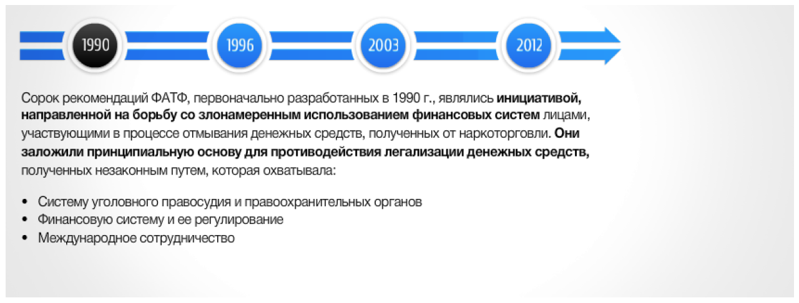
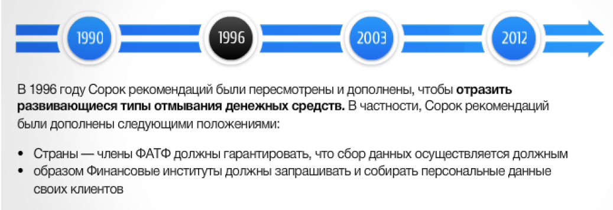
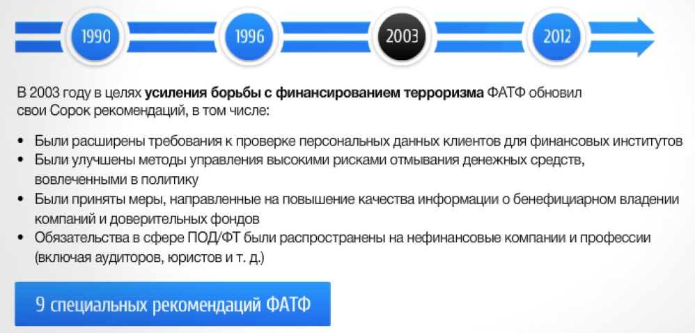
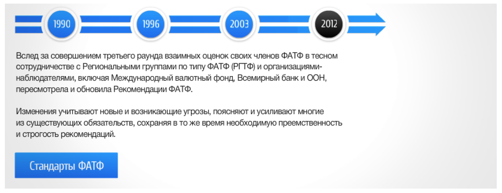

## Лекция 4. Международные стандарты ПОД/ФТ/ФРОМУ. Часть 2

### Рекомендации ФАТФ - Общие положения

**Современные международные стандарты** в сфере ПОД/ФТ включают принципы и нормы, установленные Рекомендациями ФАТФ, Базельским комитетом по банковскому надзору, Вольфсбергской банковской группой (Вольфсбергские принципы), Отделом по контролю зарубежных активов Министерства финансов США (OFAC) Директивами и Конвенциями Европейского союза, Конвенциями и Резолюциями Совета Безопасности ООН и другими стандартами

**Рекомендации ФАТФ** устанавливают комплексную и последовательную структуру мер, которые странам следует применять для ПОД/ФТ

Страны имеют различные правовые, административные и оперативные структуры и различные финансовые системы, в связи с чем не могут принимать идентичные меры по противодействию этим угрозам Поэтому странам следует адаптировать к своим конкретным условиям Рекомендации ФАТФ, которые устанавливают международные стандарты

### Организации и специализированные органы

Международные организации входящие в структуру ПОД/ФТ

### Рекомендации ФАТФ. Обзор 40 Рекомендаций ФАТФ

### Рекомендации ФАТФ. 9 специальных рекомендаций ФАТФ

**После террористического акта 11 сентября 2001** года в дополнение к Сорока рекомендациям ФАТФ были **приняты Восемь специальных рекомендаций ФАТФ**, направленных на противодействие **финансированию терроризма**.

Эти рекомендации были приняты на чрезвычайном Пленарном заседании ФАТФ 29-30 октября 2001 года. Позднее, в 2004 году, к ним добавилась девятая специальная рекомендация. С этого момента рекомендации ФАТФ стали именоваться как 40 + 9 рекомендаций. В 2012 г. на базе **40 + 9** рекомендаций была подготовлена обновленная редакция 40 рекомендаций ФАТФ.

### Методология оценки технического соответствия. Рекомендациям ФАТФ и эффективности систем ПОД/ФТ

Методология представляет собой основание для проведения оценки технического соответствия новым Рекомендациям ФАТФ, принятым в феврале 2012 года, для изучения уровня эффективности страховой системы противодействия отмыванию денег и финансированию терроризма (ПОД/ФТ)

- Предназначена для оказания содействия экспертам-оценщикам при проведении оценки соблюдения страной международных стандартов ПОД/ФТ
- Отражает требования, изложенные в Рекомендациях ФАТФ и Пояснительных записках, которые устанавливают международный стандарт противодействия отмыванию денег и финансированию терроризма и распространения ОМУ, не изменяя и не превышая эти требования.

*При подготовке Методологии был использован опыт проведения оценок соответствия более ранним версиям Рекомендаций ФАТФ, накопленный ФАТФ, Региональными группами по типу ФАТФ (РГТФ), Международным валютным фондом и Всемирным банком*

### Компоненты методологии оценки

Для четвертого раунда взаимных оценок ФАТФ приняла взаимодополняющие подходы к оценке технического соответствия Рекомендациям ФАТФ и оценке того, является ли система ПОД/ФТ эффективной и до какой степени.

Таким образом, **Методология содержит два компонента**:

- **Оценка технического соответствия** касается конкретных требований Рекомендаций ФАТФ, главным образом того, как они соотносятся с соответствующей правовой и институциональной системой страны; а также полномочия и процедуры компетентных органов. Они представляют собой основные структурные элементы системы ПОД/ФТ.
- **Оценка эффективности** радикально отличается от оценки технического соответствия. Она предполагает оценку достаточности применения Рекомендаций ФАТФ и определяет степень достижения страной определенного набора результатов, которые являются главными для построения надежной системы ПОД/ФТ.

Таким образом, в центре внимания оценки эффективности находится степень достижения правовой и институциональной системой ожидаемых результатов.

### Критерии технического соответствия. Критерии эффективности

Методология оценки технического соответствия рекомендациям ФАТФ и эффективности систем ПОД/ФТ

| | Рейтинги технического соответствия | |
| - | --- | - |
| Соответствует | C | Недостатки отсутствуют. |
| В значительной степени соответствует | LC |  Имеются только незначительные недостатки. |
| Частично соответствует | РС | Имеются умеренные недостатки. |
| Не соответствует | NC | Имеются серьезные недостатки. |
| Неприменимо | НА | Требование неприменимо из-за структурных, правовых или институциональных особенностей страны. |

При определении уровня недостатков по каждой Рекомендации эксперты должны оценить,
с учётом контекста страны, количество и относительную важность выполненных или не
выполненных критериев.

| | Рейтинги эффективности |
| - | --- |
| Высокий уровень эффективности | Непосредственный Результат достигнут в очень большой степени. Требуются незначительные улучшения. |
| Значительный уровень эффективности | Непосредственный Результат достигнут в большой степени. Требуются умеренные улучшения. |
| Умеренный уровень эффективности | Непосредственный Результат достигнут в некоторой степени. Требуются значительные улучшения. |
| Низкий уровень эффективности | Непосредственный Результат не достигнут или достигнут в ничтожной степени. Требуются фундаментальные улучшения. |

<!-- ### Непосредственный результат 1 - Риск и координация

Риски ОД и ФТ понимаются и, при необходимости, координируются внутри страны для борьбы с ОД, ФТ и ФРОМУ

- Насколько хорошо страна понимает свои риски?
- Насколько хорошо устраняются риски?
- Есть ли прочная основа для изъятий, упрощённых мер и усиленных мер?
- Насколько хорошо власти сотрудничают и координируются?
- Насколько осведомлены о рисках финансовые учреждения и УНФПП?

### Непосредственный результат 2 - Международное сотрудничество

В рамках международного сотрудничества предоставляется соответствующая информация, данные финансовой разведки и доказательства, а также облегчается принятие мер против преступников и их активов

- Насколько эффективно страна оказывает взаимную юридическую помощь (ВЮП)
- Насколько эффективно страна запрашивает ВЮП?
- Насколько эффективно страна запрашивает другие виды помощи?
- Насколько эффективно страна оказывает другие виды помощи?
- Насколько эффективно страна предоставляла информацию о бенефициарной собственности? -->
