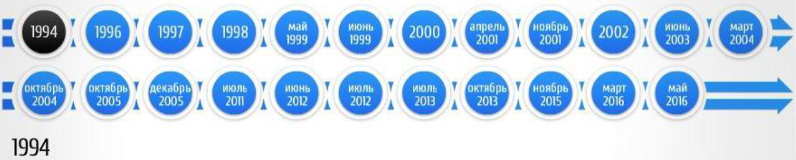

## Лекция 6. Основные этапы становления национальной системы ПОД/ФТ

### Основные этапы становления национальной системы ПОД/ФТ

1994

Формирование национальной системы ПОД/ФТ в России началось с разработки концепции и проекта Федерального закона **«Об ответственности за легализацию преступных доходов»** в соответствии с Указом Президента Российской Федерации №1016 от 24 мая 1994 года.

В процессе работы над проектом указанного Федерального закона при согласовании его с правоохранительными, экономическими и финансовыми ведомствами его концепция изменилась. Законопроект стал называться проектом Федерального закона **«О противодействии легализации (отмыванию) доходов, полученных незаконным путем»**.

1996

В связи с подготовкой рассматриваемого Федерального закона в принятом в 1996 году Уголовном кодексе Российской Федерации появилась **статья 174**, установившая уголовную ответственность за легализацию (отмывание) доходов, полученных незаконным путем.

Та же концепция была реализована при разработке Модельного закона **«О противодействии легализации (отмыванию) доходов, полученных незаконным путем»**, принятого Межпарламентской Ассамблеей государств - участников СНГ 8 декабря 1998 года.

1997

Россия приняла участие в деятельности **Комитета Совета Европы по оценке мер борьбы с отмыванием денег**, созданного в 1997 году.

1998

21 октября 1998 года Государственная Дума Российской Федерации приняла Федеральный закон **«О противодействии легализации (отмыванию) доходов, полученных незаконным путем»**, который затем не получил необходимого одобрения со стороны Совета Федерации.

1999

В мае 1999 года **Россия подписала Страсбургскую конвенцию** Совета Европы об отмывании, выявлении, изъятии и конфискации доходов от преступной деятельности 1990 года. Чуть позднее при МВД РФ был создан **Межведомственный центр по ПОД/ФТ**.

Создание Межведомственного центра внесло большой вклад в реализацию в России международных стандартов борьбы с отмыванием денег, координацию деятельности финансовых, правоохранительных и контрольных органов. Однако Центр **не мог выполнять функции национального** ПФР из-за отсутствия в стране системы обязательного представления финансовыми учреждениями информации о подозрительных операциях. Для создания такой системы требовалась соответствующая правовая основа, включая базовый закон о борьбе с отмыванием денег.

**Состав Межведомственного центра**

Помимо сотрудников МВД РФ, в состав межведомственного центра вошли сотрудники следующих государственных органов:

1. Министерство финансов Российской Федерации
2. Министерство экономики Российской Федерации
3. Министерство Российской Федерации по налогам и сборам (Федеральная налоговая служба)
4. Государственный таможенный комитет России
5. Федеральная служба безопасности Российской Федерации
6. Федеральная служба налоговой полиции Российской Федерации
7. Федеральная служба России по валютному и экспортному контролю

**Основные задачи Межведомственного центра**

1. Сбор, анализ, проверка сведений в сфере ПОД/ФТ
2. Организация взаимодействия и сотрудничества в сфере ПОД/ФТ
3. Информационно аналитическое и организационно методическое обеспечение ПОД/ФТ

После доработки законопроекта 4 июня 1999 года он был принят Государственной Думой в измененной редакции, а 25 июня 1999 года одобрен Советом Федерации. Федеральный закон «О противодействии легализации (отмыванию) доходов, полученных незаконным путем», был отклонен Президентом Российской Федерации.

Согласно указанному законопроекту сообщения об операциях, подлежащих обязательному контролю, следовало направлять в государственные налоговые инспекции, а об операциях с иностранной валютой - в Федеральную службу России по валютному и экспортному контролю. Такой подход не позволил бы создать в России единое подразделение финансовой разведки.

2000

В июне 2000 г. **ФАТФ опубликовала список стран** и территорий, которые **не принимают целенаправленных мер** по предотвращению отмывания денег. Среди 15 стран, включенных в первую редакцию «черного списка» ФАТФ, **была указана и Россия**.

Следует признать, что на момент проведения оценки ФАТФ система противодействия отмыванию денег в России действительно отсутствовала. В качестве основного фактора, препятствующего улучшению национального режима в данной сфере, эксперты ФАТФ указали на **отсутствие в России отвечающих международным стандартам базового закона** о противодействии отмыванию денег и нормативных актов, обеспечивающих его исполнение.

2001 Апрель

Важнейшим шагом России по созданию национальной системы ПОД/ФТ стала доработка имевшихся проектов законов **«О противодействии легализации (отмыванию) доходов, полученных незаконным путем»**, и «О **внесении изменений и дополнений** в законодательные акты Российской Федерации в связи с принятием Федерального Закона «О противодействии легализации (отмыванию) доходов, полученных незаконным путем». Поправки, внесённые в закон

**Законопроекты были внесены в Государственную Думу** Президентом Российской Федерации **в апреле 2001 г.** и стали там предметом острого обсуждения. В процессе принятия законопроектов в них был внесен **ряд депутатских поправок**, направленных в основном на **сужение сферы их действия**.

1 Ноября 2001

Создан **Комитет по финансовому мониторингу** (с 2004 года - Федеральная служба по финансовому мониторингу), выполняющий функции ПФР. С момента принятия закона **«О противодействии легализации (отмыванию) доходов, полученных незаконным путем»** и создания Комитета по финансовому мониторингу в России сделан значительный шаг вперед в отношении противодействия отмыванию денег.

2002

В июне 2002 года Россия была исключена из «черного списка» ФАТФ, что стало оценкой всех тех усилий и шагов, которые были предприняты в нашей стране в сфере борьбы с отмыванием преступных доходов.

2003, июнь

Россия стала полноправным членом Группы разработки финансовых мер борьбы с отмыванием денег (FATF).

2004, март

Указом Президента Российской Федерации **«О системе и структуре федеральных органов исполнительной власти»** от 9 марта 2004 г. № 314 КФМ России преобразован в **Федеральную службу по финансовому мониторингу (Росфинмониторинг)**, подведомственную Министерству финансов РФ.

2004, октябрь

**Создание Евразийской группы** по противодействию легализации преступных доходов и финансированию терроризма (ЕАГ), в нее вошли Россия, Беларусь, Казахстан, Киргизия, Китай и Таджикистан.

2005, Декабрь

**12 декабря 2005 г.** в соответствии с распоряжением Правительства Российской Федерации от 21 ноября 2005 г. № 1989-р создана Автономная некоммерческая организация «Международный учебно-методический центр финансового мониторинга» (сокращенное наименование - МУМЦФМ).

Цели МУМЦФМ

2012, июнь

В соответствии с **Указом Президента Российской Федерации № 808** Росфинмониторинг перешел в прямое подчинение Президенту Российской Федерации. И к прочим функциям, которые получила финансовая разведка

России в процессе переподчинения, добавилась еще одна - **функция национального центра по оценке рисков и угроз национальной безопасности**, возникающих в результате легализации (отмывания) доходов, полученных преступным путем, финансирования терроризма и распространения оружия массового уничтожения.

2012, июль

В соответствии с распоряжением Президента Российской Федерации была создана Межведомственная рабочая группа по противодействию незаконным финансовым операциям (далее - МРГ).

МРГ является координационным органом, образованным в целях обеспечения эффективного взаимодействия федеральных органов исполнительной власти, иных государственных органов и Центрального банка Российской Федерации (Банка России) в сфере предупреждения, выявления и пресечения незаконных финансовых операций, противодействия незаконному выводу капитала за рубеж и в теневой оборот

2013, июль - 2014, июнь

Представитель России Владимир Нечаев являлся президентом **межправительственной Группы разработки финансовых мер по борьбе с отмыванием денег (Financial Action Task Force, FATF)**.

2013, октябрь

На Пленарном заседании ФАТФ **Российская Федерация успешно защитила 6-й отчет** о прогрессе в совершенствовании национальной системы противодействия отмыванию денег и финансированию терроризма.

**Наша страна вошла** в элитный клуб стран, национальные антиотмывочные системы которых соответствуют международным стандартам в максимальной степени.

2016, март

- Указом Президента Российской Федерации от 8 марта 2016 года № 103 расширен перечень
функций финансовой разведки - за Росфинмониторингом закреплены дополнительные
- Создание Межведомственной комиссии по подготовке Российской Федерации к четвертому раунду взаимных оценок ФАТФ на основании Распоряжения Президента Российской Федерации от 2 марта 2016 года № 31-рп

Дополнительные полномочия

Состав комиссии

> 30 мая 2018

Концепцией развития национальной системы ПОД/ФТ определены **стратегические цели для российской антиотмывочной системы**:

- Обеспечение современной нейтрализации выявляемых рисков и ликвидации угроз
национальной безопасности без привлечения дополнительных ресурсов
- Повышение прозрачности экономики и предупреждение нецелевого расходования бюджетных средств
- Дальнейшее укрепление роли РФ в международной системе ПОД/ФТ

Указанные стратегические цели предлагается реализовывать на **внутриведомственном, национальном и международном уровнях** через реализацию аналитической и координационной составляющей, направленной на выявление, предупреждение и пресечение ОД, путем

- Внедрения новых организационных форм проведения финансовых расследований, в том числе на международном уровне
- Усовершенствования технологических решений для повышения качества проводимых финансовых расследований
- Совершенствования методологического обеспечения для формирования дополнительных знаний о рисках системы ОД/ФТ на основе имеющихся ресурсов

> I. Общие положения
>
> II. Основные риски совершения операций (сделок), выявленные национальной системой
>
> III. Цели, основные направления развития национальной системы и задачи по реализации этих направлений
>
> IV. Ожидаемые результаты реализации Концепции

**17 декабря 2019**

**ОПУБЛИКОВАН ОТЧЕТ О ВЗАИМНОЙ ОЦЕНКЕ РОССИЙСКОЙ ФЕДЕРАЦИИ**

https://www.fatf gafi.org/media/fatf/documents/reports/mer4/fatf 2019 rossijskaa federacia.pdf

Результаты оценки соответствуют роли страны, как одного из лидеров международной системы противодействия отмыванию преступных доходов и финансированию терроризма, и финансированию распространения оружия массового уничтожения

24 февраля 2023
