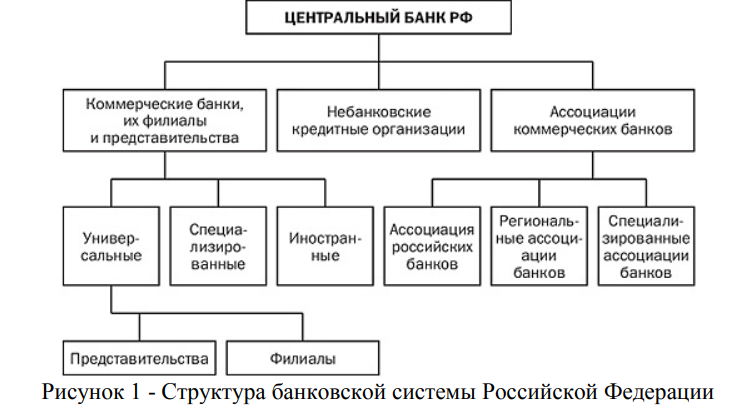
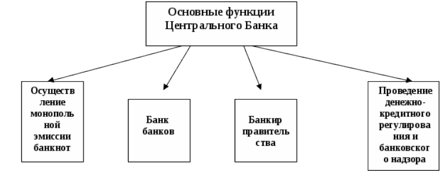
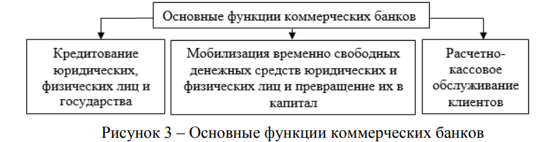
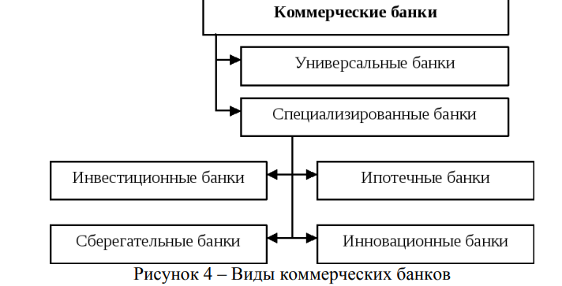
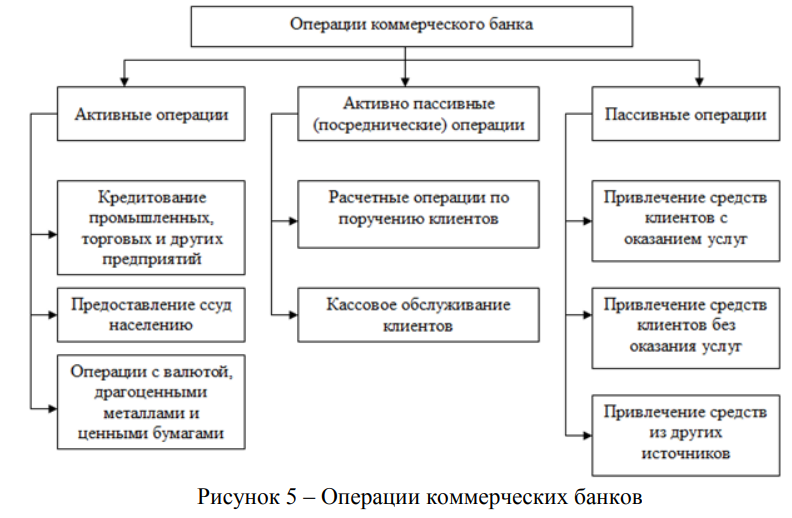

# Банковская система РФ

Giảng viên: Толстой Александр Иванович

## Нормативное регулирование

```{admonition} Федеральный закон от 02.12.1990 N 395-1 "О банках и банковской деятельности"

**Статья 2. Банковская система Российской Федерации и правовое регулирование банковской деятельности**

Банковская система Российской Федерации включает в себя Банк России, кредитные организации, а также представительства иностранных банков.

Правовое регулирование банковской деятельности осуществляется Конституцией Российской Федерации, настоящим Федеральным законом, Федеральным законом "О Центральном банке Российской Федерации (Банке России)", другими федеральными законами, нормативными актами Банка России.
```

Банковская система Российской Федерации — это совокупность взаимосвязанных элементов, которая включает Центральный банк кредитные организации, состоящие из коммерческих банков и других кредитно-расчетных учреждений, иногда объединенных в рамках холдингов, а также банковскую инфраструктуру и банковское законодательство.

Российская банковская система имеет двухуровневую структуру. 

- 1 уровень представлен Центральным банком РФ.
- 2 уровень включает банки и небанковские кредитные организации, а также филиалы и представительства иностранных банков.

Банковская деятельность является лицензируемым видом деятельности.



1) Банк России (Центральный банк Российской Федерации – ЦБ РФ);
2) коммерческие банки:
    - а) универсальные – выполняют любые операции;
    - б) иностранные;
    - в) специализированные;
3) небанковские кредитные организации (фонды, инвестиционные компании);
4) банковские ассоциации (это некоммерческие общественные организации, членами которых являются коммерческие банки, и создаются они для представления их интересов в органах законодательной, исполнительной и судебной власти).

**Кредитная организация** - это юридическое лицо, которое для извлечения прибыли как основной цели своей деятельности на основании специального разрешения (лицензии) Центрального банка РФ (Банка России) имеет право осуществлять банковские операции, предусмотренные Законом о банках.

**Банк** – это специализированная кредитная организация, созданная для привлечения денежных средств и размещения их от своего имени на условиях срочности, платности и возвратности.

**Небанковская кредитная организация** – кредитная организация, имеющая право осуществлять отдельные банковские операции (инвестиционные и страховые компании, ломбарды, инкассации и др.)

**Банковская инфраструктура** - совокупность институтов, формирующих необходимые условия для осуществления банковской деятельности и содействующих созданию и доведению банковских услуг до их потребителей. К ним можно отнести:

- систему страхования вкладов, обеспечивающую гарантирование сохранности вкладов граждан в банках в рамках установленных законодательством норм, которое осуществляется специально созданным государством Агентством по страхованию вкладов (АС В);
- независимые платежные системы, оказывающие содействие в осуществлении расчетов между организациями и банками, например, SWIFT, и платежных операций по пластиковым картам, например, VISA, MasterCard, American Express;
- аудиторские организации, обеспечивающие независимую проверку деятельности как коммерческих банков, так и Центрального банка РФ и подтверждение их финансовой отчетности;
- организации - поставщики информационно-технологических решений, разрабатывающие и предоставляющие банкам современные банковские технологии, направленные на автоматизацию их бизнес-процессов и достижение высокого уровня безопасности.

**Источниками банковского законодательства РФ** являются: Конституция РФ; нормы международного банковского права и международные договоры РФ; решения Конституционного Суда РФ; Гражданский кодекс (ГК) РФ; Федеральный закон «О банках и банковской деятельности»; Федеральный закон «О Центральном банке Российской Федерации (Банке России)»; подзаконные нормативные правовые акты (инструкции, положения, циркуляры и т.п.).

Кроме того, в современной банковской системе банки классифицируются:

- на крупные, средние и малые — по масштабам деятельности и объему собственного капитала;
- на специализированные и универсальные — по характеру осуществляемых операций;
- на международные, всероссийские, межрегиональные и региональные — по сфере обслуживания;
- на банки с иностранным капиталом и без иностранного капитала;
- на многофилиальные и бесфилиальные.

Отдельную категорию составляют системно значимые банки — самые крупные организации по количеству клиентов и объему активов, играющие «финансообразующую» роль в банковской системе. 

Банковская система России на сегодня включает одиннадцать системно значимых компаний:

- четыре государственных — Сбербанк России, ВТБ, Газпромбанк, Россельхозбанк;
- четыре частных без иностранного капитала — Альфа-банк, Московский Кредитный Банк (МКБ), ФК «Банк Открытие», Промсвязьбанк;
- три частных с иностранным капиталом — Райффайзенбанк, ЮниКредит Банк, Росбанк.

Банковская система функционирует не изолированно, а во взаимосвязи. Эта взаимосвязь проявляется через осуществление межбанковских расчетов, когда банк по поручению клиентов осуществляет платежи через:

1) расчетную сеть Банка России;
2) банки-корреспонденты;
3) банки, уполномоченные вести счета определенных видов (специализированные банки);
4) клиринговые центры (небанковские кредитные организации, осуществляющие расчетные платежи).

```{admonition} Основные свойства банковской системы
:class: important
1) иерархичность построения;
2) наличие отношений и связей;
3) упорядоченность отношений и связей;
4) наличие процессов управления;
5) взаимодействие со средой.
```

На развитие банковской системы влияют внешние и внутренние факторы.

**Внешние факторы** – это факторы среды: экономические, политические, правовые, социальные, форсмажорные.

- **Экономические факторы** – исполнение федерального бюджета характер кредитно денежной политики, система налогообложения результаты экономических реформ. В случае кризисов происходит ухудшение деятельности банков – снижаются их надежность 
и ликвидность.
- **Политические факторы** – решения органов власти и управления которые влияют на решения, принимаемые ЦБ РФ, кредитными организациями.
- **Правовые факторы** – устойчивое законодательство, его консервативность создают предпосылки правового регулирования. Законодательство влияет на правила банковских операций или сделок, разрешая или запрещая их.
- **Социальные факторы** – уверенность населения в правильности проводимых экономических преобразований, стабильности законодательства.

**Внутренние факторы** – это совокупность факторов, которые формируются самой банковской системой и субъектами.

Существует ряд сложностей развития банковской системы:

1) недостаточно квалифицированные кадры;
2) недостаточно квалифицированное управление банковскими рисками;
3) недокапитализация банковской системы (нехватка средств);
4) увеличение спекулятивных операций на финансовом рынке в ущерб работе с реальным сектором.

В систему ЦБ РФ входят: *центральный аппарат*, *территориальные учреждения*, *расчетно-кассовые центры*, *вычислительные центры*, *хранилища*, *учебные заведения*.

Главный банк России был учрежден в 1860 г. на базе учрежденных еще Екатериной II государственных банков.

```{admonition} Функции ЦБ РФ
:class: important
1) эмиссионный банк, за которым закреплена монополия эмиссии (эмиссия – выпуск денежной массы);
2) Банк Правительства, который обслуживает исполнение бюджета и управляет государственным долгом;
3) Банк банков, т. е. расчетный центр, который ведет счета коммерческих банков, связанных с межбанковскими операциями и хранением резервов;
4) кредитор последней инстанции (кредиты для коммерческих банков);
5) проводник денежно-кредитной и валютной политики;
6) орган надзора за банками и финансовыми рынками.
```

```{admonition} Основной источник ресурсов ЦБ РФ
:class: important
1) деньги в обращении (то, что он напечатал);
2) средства коммерческих банков (заемные средства, которые дал банк).
```

Центральный банк Российской Федерации создает свои ресурсы двумя методами:

1) деньги из балансовых хранилищ приходуются на баланс, т. е. перемещаются в оборотные кассы, из них – уходят в обращение;
2) ЦБ РФ увеличивает свои кредитные вложения путем выдачи ссуд, повышающих остатки на счетах (депозитах).

Денежное обращение регулируется ЦБ РФ в процессе осуществления кредитной политики, выражаемой в кредитной экспансии или рестрикции.

**Экспансия** – увеличение кредитных ресурсов коммерческих банков, которые, выдавая кредиты, повышают массу денег в обращении.

**Рестрикция** – ограничение возможностей коммерческих банков.

Инструментами экспансии и рестрикции являются: официальная учетная ставка ЦБ РФ, некоторые неэкономические меры (неразрешение коммерческим банкам некоторых видов 
операций).

Официальная учетная ставка ЦБ РФ – это процент по ссудам, используемым ЦБ РФ при кредитовании коммерческих банков; размер ее зависит от уровня ожидаемой инфляции и в то же время оказывает влияние на инфляцию.

```{admonition} Основные меры денежно-кредитного регулирования
:class: important
1) операции на открытом рынке (банк не только проводит свою денежно-кредитную политику, но и помогает коммерческим банкам поддерживать уровень их ликвидности, т.е. способность выполнять в срок свои обязательства перед клиентом; операции на открытом рынке – это операции купли-продажи ЦБ РФ государственных ценных бумаг);
2) рефинансирование банков – предоставление кредита коммерческим банкам через аукционы и ломбардные кредиты (ссуды под залог ценных бумаг);
3) валютное регулирование (ЦБ РФ контролирует курс, проводит операции на валютном рынке);
4) управление наличной денежной массой (эмиссия денег, организация их обращения и изъятие из обращения);
5) резервирование денег коммерческих банков путем депонирования в ЦБ РФ (размер резервных требований по депонированию устанавливается в процентах к общей сумме  денежных средств, привлеченных банком; при закрытии коммерческого банка резерв 
возвращается);
6) банковский надзор и регулирование (ЦБ РФ следит за соблюдением законодательства, нормативных актов Банка России; главная цель надзора – поддержание стабильности банковской системы, защита интересов вкладчиков и кредиторов).
```

Для всех коммерческих банков установлены обязательные правила:

1) проведение банковских операций;
2) ведение бухгалтерского учета;
3) составление и предоставление бухгалтерской и статистической отчетности.

Коммерческие банки действуют на основании лицензии. Банки создаются на основе следующих организационно-правовых форм: акционерное общество и общество с ограниченной ответственностью. 

Акционерные банки могут быть закрытого (акции банка могут переходить из рук в руки при согласии большинства акционеров) и открытого типов (акции переходят из рук в руки без согласия акционеров по открытой подписке).

Банк может выполнять два вида операций:

1) активные операции – операции по размещению денежных средств вкладчиков с целью получения прибыли. В качестве такого рода операций могут выделяться кредитные операции, операции с ценными бумагами, кассовые, акцептные, сделки с иностранной валютой, недвижимостью. В результате активных операций банки получают дебетовые проценты, которые выше кредитовых, выплачиваемых по пассивным операциям. Разница между дебетовыми и кредитовыми процентами называется маржой и является одной из важных статей дохода банка;
2) пассивные операции – операции по привлечению денежных средств в банк.

Прекращение деятельности банка происходит путем его реорганизации или ликвидации (добровольной или принудительной)

## Роль ЦБ РФ и его функции

Центральный банк Российской Федерации (Банк России) — особый публично-правовой институт России, главный банк первого уровня. 

Центральный банк – государственный банк, осуществляющий централизованное кредитование, организующий и контролирующий денежное обращение. 

Уставный капитал и иное имущество ЦБ РФ являются федеральной собственностью. Он осуществляет свои расходы за счет собственных доходов, а не финансируется за счет бюджета. При этом получение прибыли не является целью деятельности Банка России (50% прибыли перечисляет в федеральный бюджет, остальную – направляет в резервы и фонды различного назначения).

Основными целями деятельности Банка России являются:

- защита и обеспечение устойчивости рубля;
- развитие и укрепление банковской системы России;
- обеспечение стабильности и развитие национальной платёжной системы;
- развитие финансового рынка России;
- обеспечение стабильности финансового рынка России.

ЦБ РФ подотчетен Государственной думе, которая назначает и освобождает Председателя Банка и членов Совета директоров (12 членов на 4 года).

Банк России образует единую централизованную систему с вертикальной структурой, в которую входят центральный аппарат, территориальные учреждения, отделения на местах (не имеют статуса юридического лица).

ЦБ РФ выполняет следующие функции (рис.2):



1) монопольная эмиссия банкнот;
2) рефинансирование банков, т.е. кредитование Банком РФ других банков;
3) проведение денежно-кредитного регулирования в стране;
4) обслуживание Правительства РФ (учет бюджетных средств);
5) установление нормативов обязательных резервов для коммерческих банков;
6) операции на открытом рынке (ценных бумаг);
7) валютное регулирование;
8) надзор и контроль кредитных организаций, выдача лицензий на осуществление банковских операций (для банков минимальный уставный капитал – 1 млн.евро).

## Коммерческие банки, их функции и операции

**Коммерческий банк** - кредитное учреждение, осуществляющее банковские операции для юридических и физических лиц.

Основная цель их деятельности – получение прибыли, которая образуется из разности процентов, взимаемых с клиентов и выплачиваемых им по банковским операциям, а также за счет комиссионных сборов за оказываемые услуги.

Коммерческими называются все без исключения организации банковской системы страны, оказывающие частным и юридическим лицам банковские услуги. К этим услугам относятся (рис.3):

- кредитование — предоставление кредитов частным клиентам (ипотечные, автокредиты, потребительские нецелевые займы) и предприятиям, относящимся к реальному сектору экономики;
- операции с драгметаллами;
- валютные операции;
- расчетно-кассовое обслуживание клиентов;
- ведение банковских счетов;
- эмиссия банковских карт — пластиковых и виртуальных;
- инкассация;
- привлечение вкладов и выплата процентов согласно соответствующим договорам;
- осуществление денежных переводов;
- реализация банковских гарантий.



По характеру деятельности коммерческие банки подразделяют на универсальные и специализированные (рис.4).



В российской банковской системе преобладают универсальные коммерческие банки.

Все операции коммерческого банка можно разделить на три основные группы (рис. 5):

1) **пассивные операции** – операции по привлечению средств в банки, формированию ресурсов банка. К ним относятся:

    - прием вкладов и депозитов (до востребования, срочных сберегательных) от юридических и физических лиц;
    - открытие и ведение расчетных и иных счетов юридических лиц;
    - получение межбанковских кредитов;
    - эмиссия инвестиционных ценных бумаг.
2) **активные операции** – операции по размещению финансовых ресурсов. К ним относятся:

    - кредитование;
    - банковские инвестиции;
    - приобретение ценных бумаг, учет векселей.



3) **активно-пассивные операции** – комиссионные, посреднические операции, выполняемые банками по поручению клиентов за определенную плату – комиссию. К ним относятся:

    - расчетно-кассовое обслуживание клиентов;
    - посреднические операции с ценными бумагами, иностранной валютой по поручению и за счет клиентов;
    - выдача поручительств за третьих лиц, предусматривающих исполнение обязательств в денежной форме;
    - траст – доверительное управление активами клиентов по доверенности в течение определенного периода;
    - факторинг – приобретение права требования от третьих лиц исполнения обязательств в денежной форме;
    - лизинговые операции – долгосрочная аренда техники и оборудования;
    - осуществление операций с драгоценными металлами и драгоценными камнями.

Задания
Правовое положение кредитных организаций. Задачи.
Банк России отозвал у кредитной организации лицензию. Кредитная организация, у которой была отозвана лицензия, не приступила к процедуре ликвидации, и в отношении нее не применялась процедура банкротства. По истечении месяца с момента отзыва у кредитной организации лицензии Банк России обратился в арбитражный суд с иском о ликвидации кредитной организации.

Признает ли суд требования Банка России обоснованными и удовлетворит ли предъявленный иск?

Закон одной из республик РФ о ее участии в уставном капитале кредитной организации предусматривал увеличение доли указанного субъекта РФ до 52,1% по предложению правительства республики без указания вносимого в уставный капитал имущества. Прокурор республики обратился в суд с заявлением о признании данной законодательной нормы противоречащей федеральному законодательству, недействующей и не подлежащей применению с момента принятия. Суд предъявленное заявление прокурора республики удовлетворил.

Чем можно обосновать судебное решение и насколько оно законно?

Требуется дать заключение, может ли банк, уже имеющий имущество в неденежной форме в размере 20% уставного капитала, в случае увеличения уставного капитала увеличить и долю имущества в неденежной форме в уставном капитале?

Допустим ли взнос в уставный капитал банка в виде здания (или его части), если размещение в нем филиала (дополнительного офиса) банка планируется лишь в отдаленной перспективе?

После принятия решения об увеличении уставного капитала банка, созданного в форме ООО, за счет внесения дополнительных вкладов банк проверил финансовое положение участников. Оказалось, что некоторые из них имеют неудовлетворительное финансовое положение и поэтому не могут участвовать в увеличении уставного капитала банка.

Будет ли соответствовать требованиям Федерального закона «Об обществах с ограниченной ответственностью» порядок увеличения уставного капитала банка за счет внесения дополнительных вкладов всеми участниками банка пропорционально размеру своей доли без участия участников с неудовлетворительным финансовым положением?

Кредитная организация обратилась в суд с ходатайством о приостановлении действия решения Банка России о назначении временной администрации как меры по предупреждению банкротства. Суд со ссылкой на ч. 3 ст. 199 АПК, согласно которой по ходатайству заявителя арбитражный суд может приостановить действие оспариваемого акта (решения), предъявленное ходатайство удовлетворил.

Законно ли решение суда?

В период конкурсного производства, открытого в отношении банка, кредитор направил конкурсному управляющему требование о включении в реестр требований должника в размере 1млн долл. США. Однако решением конкурсного управляющего вышеназванное требование кредитора не было включено в реестр требований по тем основаниям, что оно является задолженностью филиала банка, который якобы является самостоятельным юридическим лицом, расположенным за границей, к которому и нужно предъявлять это требование, и, кроме того, в отказе сделаны ссылки и на тот факт, что филиал банка является единственным отделением банка-должника, в отношении которого проводятся независимые действия по банкротству на основании законов страны пребывания — Кипра. Кредитор обратился в арбитражный суд с жалобой на указанные действия конкурсного управляющего.

Какое решение должен вынести арбитражный суд?

Решением арбитражного суда с банка в пользу индивидуального предпринимателя были взысканы 80 тыс. руб. в виде остатка денежных средств на счете, и по указанному делу был выдан исполнительный лист. Предприниматель направил исполнительный лист в операционное управление территориального управления Банка России для исполнения. Исполнительный лист был возвращен заявителю, поскольку в отношении банка-должника было принято решение о ликвидации. Полагая, что действия Банка России по возврату исполнительного листа были неправомерными, предприниматель обратился в арбитражный суд.

Какое решение должен вынести суд?